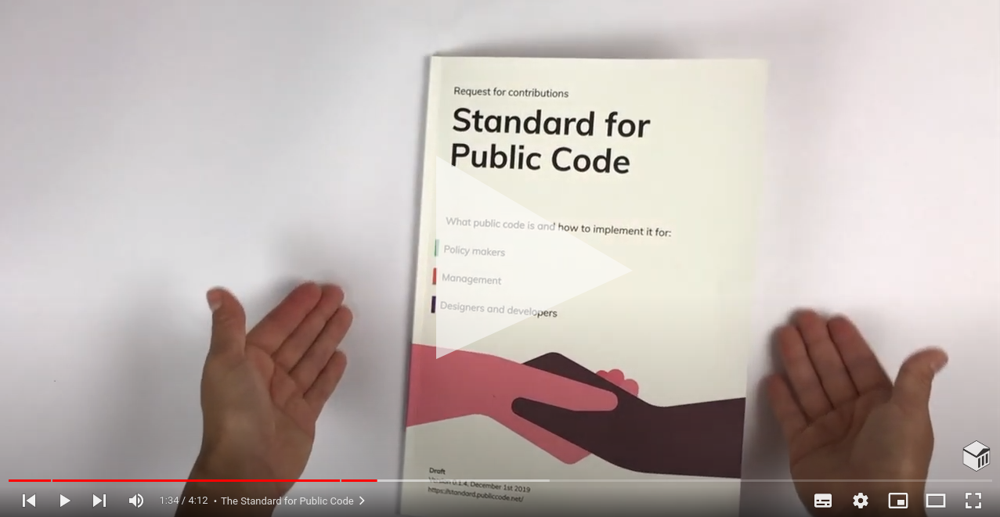

---
redirect_from:
    - /talks-and-articles
---

# Resources and projects

Built when we discovered a need in our own [codebase stewardship practice](https://publiccode.net/codebase-stewardship/), these resources are all openly licensed. We'd love to hear how you use these.

See more of our work in:

* the [codebases we work with](https://publiccode.net/codebases/)
* [our conference talks](talks.md)
* [articles we've written](articles.md)
* [our blog](https://blog.publiccode.net/)

## Current projects

We rely on these resources for our everyday work.

### [Standard for Public Code](http://standard.publiccode.net/)

The Standard for Public Code gives public organizations a model for building their own open source solutions to enable successful future reuse by other public organizations.
It includes guidance for policymakers, managers, developers and designers.

This is a living document, and [we welcome your feedback](http://standard.publiccode.net/CONTRIBUTING.html).

#### [Community built implementation guide](https://publiccodenet.github.io/community-implementation-guide-standard/)

To let the community of users of Standard for Public Code share their implementation choices for the criteria to guide other users, we created a resource where tips, examples and tools can be added.

#### [Introduction course](https://citybycity.academy/course/standards-for-smart-cities)

Together with [Open & Agile Smart Cities](https://oascities.org/) we have created a free and open online introduction course to the Standard for Public Code.
It's a self study course and offers a certification of completion to those who finish all the modules.

#### [Community translations](https://publiccodenet.github.io/community-translations-standard/)

To increase the accessibility of the Standard for Public Code, the [translations repository](https://github.com/publiccodenet/community-translations-standard) allows for the community to collaborate on translations of it.
It is possible to add more translations as more communities find it useful and are willing to translate and review.

### [Software procurement process code](https://processcode.publiccode.net/)

Process codes are flexible, collaborative, and adaptive guidebooks for a new government process.

The software procurement process code helps public sector employees source the best possible software.
It walks through government contracting step-by-step, aligning legitimate public procurement with the cutting-edge best practices of development.

We invite you to test, revise, and expand this process code, joining a growing community of practitioners.

### [Governance game](https://github.com/publiccodenet/governance-game)

A game exploring governance of a public codebase.
It helps participants reflect on what governances means for a codebase, the complexity around it, and surfaces issues worth considering during set up.

The game is also useful as a tool for visualizing how a current governance model is set up or could be changed.

### [Let's talk about public code](https://podcast.publiccode.net)

A podcast where we interview people with interesting perspectives on public code.
Recorded as a live stream and then edited to an audio podcast version.

### [OSPO Alliance and OSPO.Zone](https://ospo.zone/)

The OSPO Alliance aims to help companies and public institutions discover and understand open source, start benefiting from it across their activities and grow to host an Open Source Program Office (OSPO).
It will be focused on the role of OSPOs as an aspect of organizational governance essential in non-technology sectors including education and public administration.

This is an initiative we've taken with OW2, Eclipse Foundation and OpenForum Europe.

### [Bumperscripter](https://github.com/publiccodenet/bumperscripter/)

We made a script for our livestreamed podcast [Let's talk about public code](https://www.youtube.com/playlist?list=PL_5ziu2gADmBPPsDlo4sMt1M7Yd8LvOBK) to easily generate variations of a video bumper animation.

When producing livestreams it's useful to have an introduction video for people who are joining the livestream so they know the stream is online, active and about to start.

### [url-check](https://github.com/publiccodenet/url-check/)

We made a script for checking the external links of repositories.
In order to move away from each repository having to implement external link checking, especially as many links are the same across repositories, we use this script in [publiccodenet-url-check](https://publiccodenet.github.io/publiccodenet-url-check/) to check the list of external links of several repositories in a single place.

## Past projects

Though our involvement with these projects has finished, we learned a lot from them. Perhaps you will too?

### [Smart Cities? Public Code!](https://smartcities.publiccode.net/) (February 2018 - April 2019)

This research project aimed to further develop the concept of public code.
It explored how we should understand public code, and how could we create it.
What kind of technological and institutional arrangements are needed to shift towards the production of public code?

Smart Cities? Public Code! was a collaboration between the City of Amsterdam, the Amsterdam University of Applied Sciences and Vurb.Agency.

### [publiccode.yml](https://github.com/publiccodenet/publiccode.yml) (2018)

A simple, easy to use, developer-centric, open source project metadata format for software developed or acquired by public administrations.

While we are no longer actively involved, we strongly encourage you to follow the project at [yml.publiccode.tools](https://yml.publiccode.tools/), or check out their [GitHub repository](https://github.com/publiccodeyml/publiccode.yml).

The standard has been adopted by the Italian government for all new public code projects in Italy, and powers the [Italian national open source software catalog](https://developers.italia.it/it/software).
